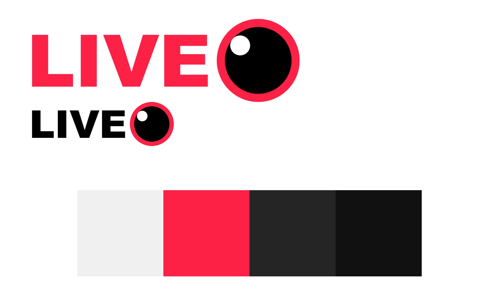

# Realtidsströmmining online

### Plattformen kommer bestå utav tre delar. En server som hanterar allting (JS, Node), en klient i Swift som används för att strömma (datorskärm och eller webcam) till serven och en HTML5 klient som kan visa och interagera med strömmarna.

## [Loggbok](https://github.com/Yogsther/LIVE/wiki/Loggbok)

## Hur det funkar

Klienterna (Swift och Java) är för att strömma. Dem använder Socket io för att ansluta till servern (Node JS) som skickar vidare bildrutorna till de tittare som tittar genom hemsidan.

En klient startar en ström genom att skicka en request till servern. Den skickar ```start_stream``` med en strömnyckel ex. ```EXAMPLE_A83920D1348EEE579E4D5E2037B93657```. Detta startar en ny instans av en stream (inte en ny instans av Node). Efter detta skickar ström-klienten bilder efter vad den har för frame rate. Bilderna skalas, komprimeras och converteras till base64 strängar som sedan enkelt kan skickas över internet.

## Prestanda

Jag inte har använt mig av någon slags MPEG kompression som använder sig av huvudbilder (I Frames) och sedan endast skickar information om hur pixlar rör sig (P Frames). Därför är min prestanda inte superbra. Det går att likna med en GIF, dem är väldigt komprimerande men är sparade bild-för-bild. I ström-klienten (Swift och Java) kan man ändra storlek på bilden, välja frame rate och hur mycket kompression man vill ha (kompressionen är JPG).

Utan någon kompression, 1920x1080 blir varje bildruta ca 378.5KB stor. Om man då skulle strömma i 30FPS blir det 11.35 MB / sekund,vilket är ca 90Mb/s. 

Med en kompression på 0.7, 640x480 blir det ca 80KB / bildruta. Alltså vid 30FPS blir det 2.4 MB/sekund eller 19.2 Mb/s.


## Design

Hemsidan kommer användas av dem som strömmar och dem som tittar. Det måste vara enkelt får begge, men framförallt för den som tittar. Ett enkelt system för att hitta en underhållande ström. Man ska inte behöva vara datakunnig för att börja strömma och det ska gå snabbt att komma igång.



## Server
Skriven i Javascript med Node. Den kommer ta emot en ström från en klient som verifieras med en "Stream-key". Sedan skickar den vidare strömmen till alla som tittar på realtids-strömmen via webbläsaren. Tittare kan också interagera med strömmen genom en chat. Servern ska klara av oändligt med instanser av strömningar, men den kommer så klart sakta ner för varje ny instans.

Servern kommer ansluta till en mySQL-databas för att hantera användaruppgifter. 

Databasen kommer ha ett table som heter users

```
Users:
    username: String
    password: Hashed password
    last_online: Date
    stream_key: Hash,
    title: String,
    description: String
```

När en användare börjar strömma kommer det skickas direkt till servern och den kommer skapa en ny instans av en ström

```javascript
    Stream {
        streamer: User,
        viewers: SocketID[] ,
        last_frame: JPG Image base64
        title: String,
        description: String
    }
```


## Klienten (Strömmare, Swift)

Klienten kommer ha en simple GUI. Man ska kunna mata in sin stream-key, se hur många tittare man har och se en förhandsgranskning av strömmen.
För anslutningen kommer jag använda SocketIO som är kompatibelt med både html5, node och Swift. Det är också kompatibelt med C++ och Java, så om jag skulle vilja göra en port senare blir det enkelt. 
(https://www.igdb.com/api), 
(https://github.com/socketio/socket.io-client-swift)

## Webb-Klienten (HTML5)

På hemsidan ska man enkelt kunna skapa en användare som man både kan titta på strömmar med och strömma själv. Man ska kunna ladda ned ström-klienten från hemsidan också. Man ska också kunna bläddra och sortera strömmar efter tittare eller vilket spel de spelar.

En person som strömmar kommer också kunna redigera sin titel och beskrivning för sin ström. 


## Streatch goals

Saker som jag vill göra om jag får tid till det:
 * Följa användare på sidan
 * Ljud support
 * Compression på strömmen
 * Webcam support och mer kontroll över det visuella som sänds
