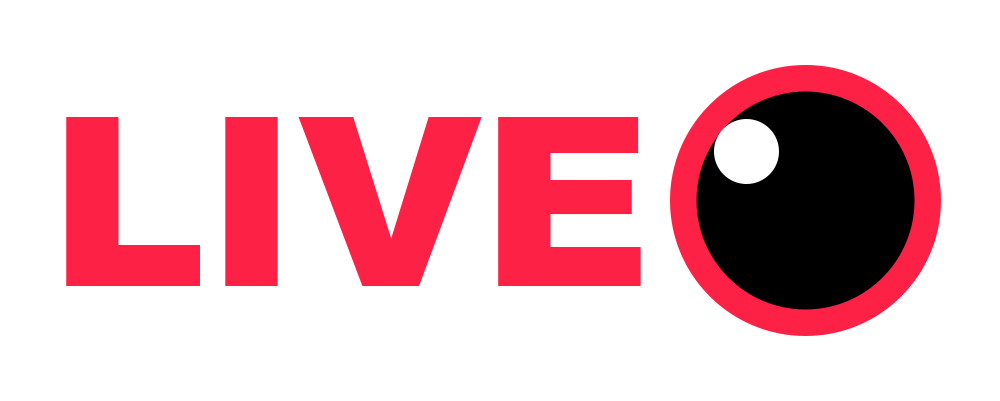

# Realtidsströmmining online



### Plattformen kommer bestå utav tre delar. En server som hanterar allting (JS, Node), en klient i Swift som används för att strömma (datorskärm och eller webcam) till serven och en HTML5 klient som kan visa och interagera med strömmarna.

## Server
Skriven i Javascript med Node. Den kommer ta emot en ström från en klient som verifieras med en "Stream-key". Sedan skickar den vidare strömmen till alla som tittar på realtids-strömmen via webbläsaren. Tittare kan också interagera med strömmen genom en chat. Servern ska klara av oändligt med instanser av strömningar, men den kommer så klart sakta ner för varje ny instans.

Servern kommer ansluta till en mySQL-databas för att hantera använderuppgifter. 

Databasen kommer ha ett table som heter users

```
Users:
    username: String
    password: Hashed password
    last_online: Date
    stream_key: Hash,
    title: String,
    description: String
```

När en användare börjar strömma kommer det skickas direkt till servern och den kommer skapa en ny instans av en ström

```javascript
    Stream {
        streamer: User,
        viewers: SocketID[] ,
        last_frame: PNG Image base64
        title: String,
        description: String
    }
```


## Klienten (Strömmare, Swift)

Klienten kommer ha en simple GUI. Man ska kunna mata in sin stream-key, se hur många tittare man har och se en förhandsgranskning av strömmen.
För anslutningen kommer jag använda SocketIO som är kompatibelt med både html5, node och Swift. Det är också kompatibelt med C++ och Java, så om jag skulle vilja göra en port senare blir det enkelt. 
(https://www.igdb.com/api), 
(https://github.com/socketio/socket.io-client-swift)

## Webb-Klienten (HTML5)

På hemsidan ska man enkelt kunna skapa en användare som man både kan titta på strömmar med och strömma själv. Man ska kunna ladda ned ström-klienten från hemsidan också. Man ska också kunna bläddra och sortera strömmar efter tittare eller vilket spel de spelar.

En person som strömmar kommer också kunna redigera sin titel och beskrivning för sin ström. 


## Streatch goals

Saker som jag vill göra om jag får tid till det:
 * Följa användare på sidan
 * Ljud support
 * Compression på strömmen
 * Webcam support och mer kontrol över det visuella som sänds