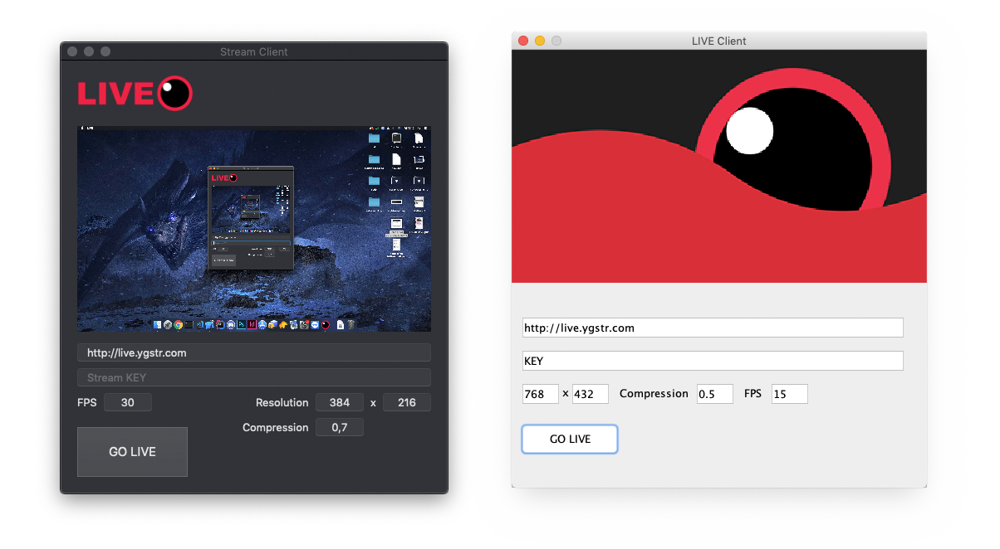
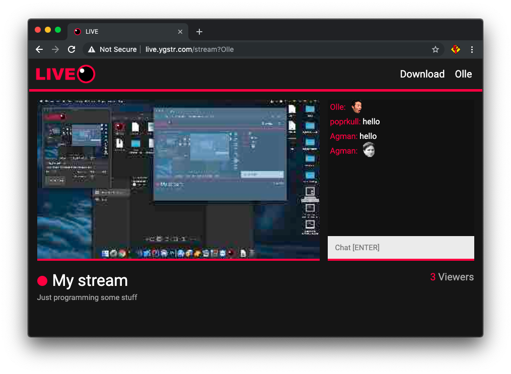

# LIVE, stream your game for others to watch


*Illustrerad bild, ej sann kvalité*


* [Loggbok](https://github.com/Yogsther/LIVE/wiki/Loggbok)
* [Plannering](PLANNERING.md)
* [JavaDocs](https://yogsther.github.io/LIVE/)

LIVE är en hemsida är du kan direktsända din skärm över till andra.

För att strömma laddar man ned en klient, Java eller Swift beroende på plattform. Sen skapar man en användare på hemsidan och därifrån får du en ström-nyckel. Sedan skrivs ens ström-nyckel in i programmet man laddat ned och man kan börja strömma. På hemsidan kan man ändra titeln på sin ström och beskrivningen.

Andra användare kan gå in på din ström genom framsidan som visar alla live strömmar eller en direkt länk till din kanal (/stream?Username).

I det här projektet finns det fyra delar. Java klienten som funkar på alla datorer. Swift klienten som funkar på macOS klienter men är också mycket snabbare än Java version (troligen p.g.a att Swift är native). Sen finns det hemsidan som används för att titta på strömmar. Sist men inte minst är servern som hanterar alla strömmar. Den är skriven i nodeJS och använder socket.io och express. Den kopplar till en SQL server som sparar all användardata. Den hanterar också chatt-systemet.

Systemet är lite begränsat på vissa sätt. För det första finns det inget ljud överhuvudtaget. Det hade nog inte varit så svårt att implementera det för att strömma, problemet var att jag inte kunde lista hur jag skulle plocka upp ljudet från användarens dator. Jag vill inte bara –strömma en mp3, utan en ström från mikrofonen och spelets ljud.

Eftersom strömmen inte använder sig utav video-kompression tar det upp mycket bredband. När en klient strömmar komprimerar den bilden som en JPEG, konverterar bilden till Base64 och skickar den till servern. På ett lokalt nätverk med en kabel-anslutning funkar det här helt okej och på skolans nätverk fungerar det bättre än vad man kan tro.

En bugg som uppkom nyligen under några senare tester är att om många strömmar samtidigt (3-5 st.) avbryts vissa strömmar. Jag vet inte varför det händer eftersom det är inte p.g.a. någon överbelastning. Jag tror det kan ha att göra med ett system jag implementerade ganska sent som ska indikera om en ström är live eller inte som kanske avbryter strömmen av misstag. 

En annan bugg som finns i Java klienten och Swift klienten är att när man ändrar värden (framförallt medans man strömmar) så försvinner värdet från input-rutan. Just nu kan man också ändra värden som kompression och width, height medans du strömmar. Så länge man inte skriver in t.ex 0 i width eller height (eftersom programmet kraschar då) så funkar det okej.


## Installation

Om du vill starta LIVE

### Förutsättningar för server
nodeJS, mySQL, NPM

### Installera servern

0. Klona det här repot
0. Skapa en mysql databas som heter "live"
0. Importera LIVE.sql ```$ mysql live < LIVE.sql ```
0. Navigera till /server
0. Konfiguera MySQL.json till din mysql server
0. Installera dependencies från NPM ```$ npm ci```
0. Starta servern ```$ sudo node index.js```


## Tester
Så här ska det se ut när du är klar.

### Swift och Java strömm-klienter


### Hemsida, framsida


### Hemsida, tittar på en strömm

